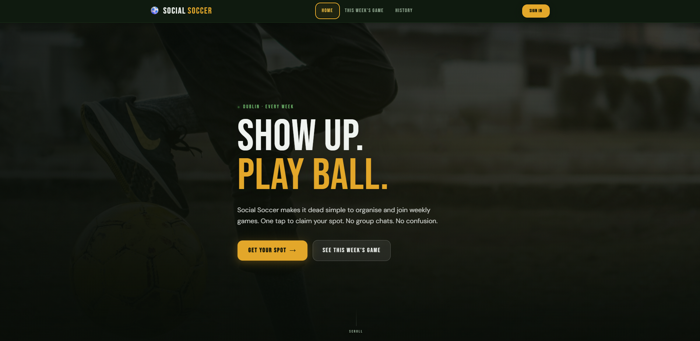
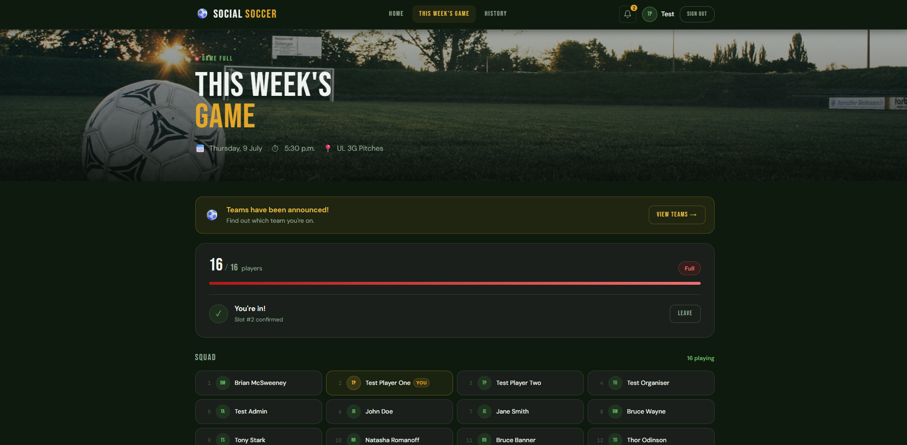
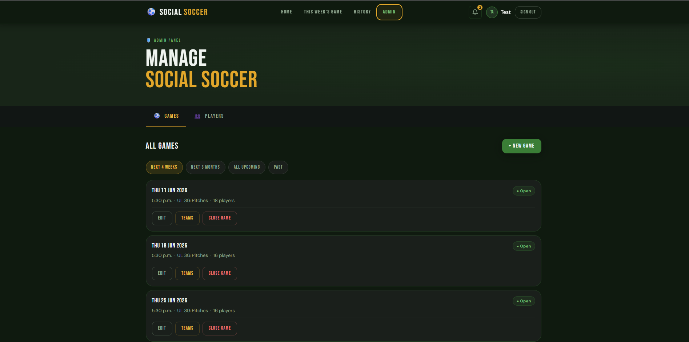
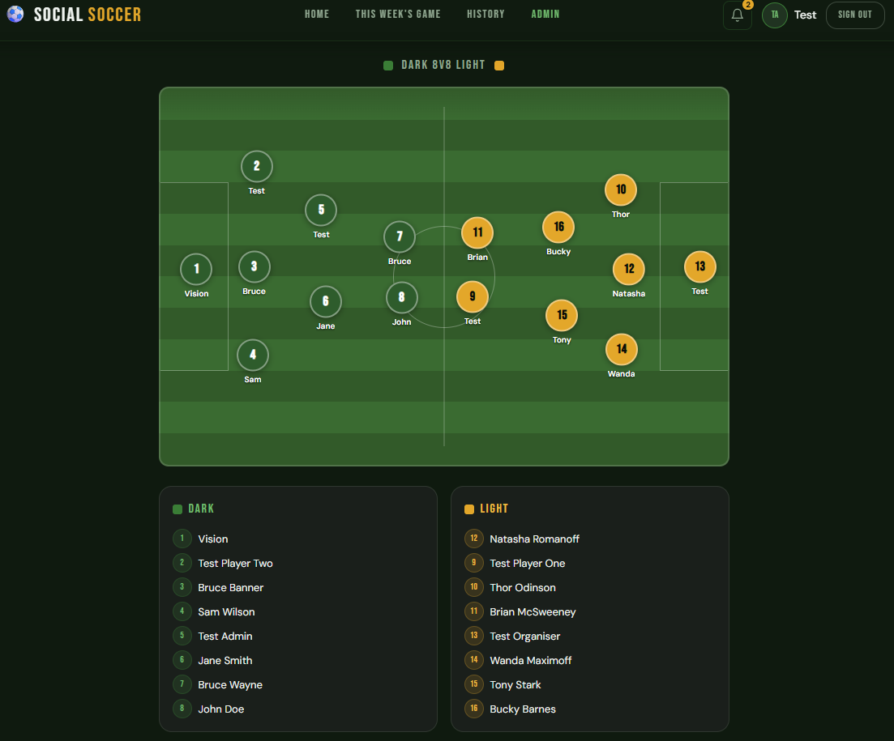
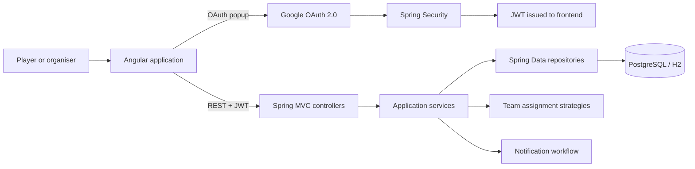
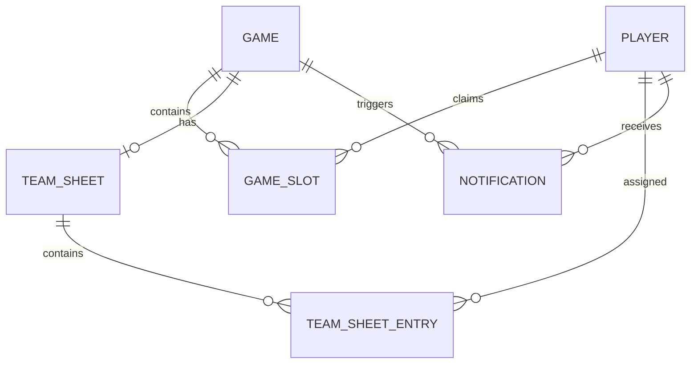

# Soccer Sign-Up

> A full-stack platform for organising weekly social soccer games without the
> usual group-chat confusion.

Soccer Sign-Up gives players one place to see the next game, claim a spot,
join the waitlist, view published teams, and track previous games. Organisers
can manage players and fixtures, close registration, build team sheets, and
notify the squad when teams are ready.

The project started as a replacement for a recurring WhatsApp sign-up message
and grew into a role-aware application with concurrency-safe registration,
automatic waitlist promotion, and an interactive team-sheet workflow.

## Live Demo

Deployment is in progress. In the meantime, the project includes a local
profile with an in-memory database, seeded users, and test login controls so
the complete workflow can be explored without configuring Google OAuth or
PostgreSQL.

## Screenshots

### Landing Page



### Game Sign-Up



### Admin Dashboard



### Team Sheet



## Features

### Players

- Register a player profile and sign in with Google OAuth 2.0.
- Browse open games with date, kick-off time, venue, and squad capacity.
- Join or leave a game with immediate status feedback.
- Move onto a first-in, first-out waitlist automatically when a game is full.
- Receive automatic promotion when a confirmed player withdraws.
- View the confirmed squad and published home and away teams.
- Review previous games through the game history view.
- Receive in-app notifications and mark one or all as read.

### Organisers and administrators

- Create, update, list, and close games.
- Manage player records, active status, and assigned roles.
- Generate an initial two-team split from confirmed players.
- Adjust team membership, jersey numbers, and pitch positions.
- Save a team sheet as a private draft before publishing it.
- Notify confirmed players when teams are published or later changed.
- Keep published teams consistent when a player leaves and a waitlisted player
  is promoted.

### Platform

- JWT-protected API requests after OAuth authentication.
- Role-based access for `PLAYER`, `ORGANISER`, and `ADMIN` workflows.
- Request validation and consistent API error responses.
- OpenAPI documentation and an interactive Swagger UI.
- PostgreSQL persistence for deployed environments and H2 for quick local use.
- Backend unit tests for registration and team-assignment domain behaviour.

## Tech Stack

| Layer | Technologies |
| --- | --- |
| Frontend | Angular 19, TypeScript, RxJS, Tailwind CSS |
| Backend | Java 17, Spring Boot 3.4, Spring Web, Spring Data JPA |
| Security | Spring Security, Google OAuth 2.0, JWT |
| Data | PostgreSQL 15, H2 for local development |
| API documentation | Springdoc OpenAPI and Swagger UI |
| Tooling | Maven Wrapper, Angular CLI, Docker, Docker Compose |
| Testing | JUnit 5, Mockito, Jasmine, Karma |

## Architecture



The frontend is organised around standalone Angular pages, components, route
guards, and API services. Its development proxy forwards `/api` requests to
the Spring Boot server on port `8080`.

The backend follows a controller-service-repository structure:

- **Controllers** define the REST contract and convert entities into response
  DTOs.
- **Services** own game, sign-up, waitlist, notification, and team-sheet rules.
- **Repositories** provide persistence through Spring Data JPA.
- **Security filters** validate JWTs and restore the authenticated player for
  role and ownership checks.
- **Strategy interfaces** separate team-sheet randomisation from team
  assignment, keeping that behaviour testable and replaceable.

### Core data model



## Engineering Decisions

### Concurrency-safe sign-up

Game capacity is shared mutable state. Two players joining the final available
place at the same time must not both be confirmed. The sign-up service loads
the game with database locking inside a transaction before counting confirmed
players and assigning either `CONFIRMED` or `WAITLISTED`.

### Automatic waitlist promotion

When a confirmed player leaves, the earliest waitlisted player is promoted.
If teams have already been published, the promoted player inherits the
vacated team, jersey number, and pitch position. This preserves a usable team
sheet while notifications keep players and organisers informed.

### Draft-first team publishing

Generated and manually edited team sheets remain private drafts until an
organiser publishes them. Regular players receive a not-found response for an
unpublished sheet, preventing accidental disclosure while still allowing
organisers to iterate.

### Replaceable team assignment

Randomisation and team assignment are represented by separate interfaces.
The current implementation shuffles confirmed players and divides them evenly
between home and away, but another policy can be introduced without changing
the team-sheet service or API.

### Local development without external identity setup

The `local` profile switches persistence to H2, seeds player, organiser, and
administrator accounts, and enables a development-only login endpoint. This
keeps production authentication concepts in place while making the project
straightforward to review locally.

## Getting Started

### Prerequisites

- Java 17 or newer
- Node.js 18 or newer
- npm
- Docker Desktop only if using PostgreSQL

### 1. Start the backend with H2

The fastest setup uses the local profile. No database installation or OAuth
credentials are required.

```bash
cd backend

# macOS / Linux
./mvnw spring-boot:run -Dspring-boot.run.profiles=local

# Windows PowerShell
.\mvnw.cmd spring-boot:run "-Dspring-boot.run.profiles=local"
```

The API starts at `http://localhost:8080`. Useful development endpoints:

- Swagger UI: `http://localhost:8080/swagger-ui/index.html`
- OpenAPI JSON: `http://localhost:8080/v3/api-docs`
- H2 console: `http://localhost:8080/h2-console`
- Health check: `http://localhost:8080/health`

H2 connection settings:

```text
JDBC URL: jdbc:h2:mem:soccerdb
User: sa
Password: [leave blank]
```

### 2. Start the frontend

In a second terminal:

```bash
cd frontend/soccer-frontend
npm install
npm start
```

Open `http://localhost:4200`. On the sign-in page, the local hostname reveals
a test-user selector. Use one of the seeded accounts:

| Role | Email |
| --- | --- |
| Player | `player1@test.local` |
| Organiser | `organiser@test.local` |
| Administrator | `admin@test.local` |

### PostgreSQL with Docker

To run PostgreSQL and the backend together:

```bash
docker compose up --build
```

The compose file exposes PostgreSQL on `5432` and the backend on `8080`.
Configure OAuth and JWT secrets through environment variables before using
this mode outside local development.

| Variable | Purpose |
| --- | --- |
| `SPRING_DATASOURCE_URL` | PostgreSQL JDBC connection URL |
| `SPRING_DATASOURCE_USERNAME` | Database user |
| `SPRING_DATASOURCE_PASSWORD` | Database password |
| `GOOGLE_CLIENT_ID` | Google OAuth client ID |
| `GOOGLE_CLIENT_SECRET` | Google OAuth client secret |
| `APP_JWT_SECRET` | Signing key of at least 256 bits |

## API Examples

The frontend sends JWTs using the `Authorization: Bearer <token>` header.
For local development, first request a token for a seeded user:

```bash
curl -X POST http://localhost:8080/api/dev/login \
  -H "Content-Type: application/json" \
  -d '{"email":"admin@test.local"}'
```

Store the returned token in your shell, then create a game:

```bash
curl -X POST http://localhost:8080/api/games \
  -H "Authorization: Bearer YOUR_TOKEN" \
  -H "Content-Type: application/json" \
  -d '{
    "gameDate": "2026-06-15",
    "kickOffTime": "19:30:00",
    "location": "Dublin",
    "maxPlayers": 14
  }'
```

Join the game as the authenticated player:

```bash
curl -X POST http://localhost:8080/api/gameslots \
  -H "Authorization: Bearer YOUR_TOKEN" \
  -H "Content-Type: application/json" \
  -d '{"gameId":1}'
```

Generate and publish teams as an organiser or administrator:

```bash
curl -X POST http://localhost:8080/api/games/1/teamsheet/auto-split \
  -H "Authorization: Bearer YOUR_TOKEN"

curl -X POST http://localhost:8080/api/games/1/teamsheet/publish \
  -H "Authorization: Bearer YOUR_TOKEN"
```

The complete API contract is available through Swagger UI while the backend
is running.

## Project Structure

```text
soccersignup/
|-- backend/
|   |-- src/main/java/.../controller/   REST endpoints
|   |-- src/main/java/.../service/      Domain workflows
|   |-- src/main/java/.../repository/   JPA persistence
|   |-- src/main/java/.../security/     OAuth and JWT handling
|   `-- src/test/                       Backend tests
|-- frontend/soccer-frontend/
|   |-- src/app/components/             Shared UI and feature components
|   |-- src/app/pages/                  Routed pages
|   |-- src/app/services/               API and authentication clients
|   |-- src/app/guards/                 Route access control
|   `-- public/assets/                  Static imagery
|-- docker-compose.yml
`-- README.md
```

## Testing

Run the backend test suite:

```bash
cd backend
./mvnw test
```

Run the Angular tests:

```bash
cd frontend/soccer-frontend
npm test
```

Create a production frontend build:

```bash
npm run build
```

## What I Learned

- Translating an informal real-world process into explicit domain states such
  as open, confirmed, waitlisted, closed, and published.
- Protecting capacity-based workflows against concurrent requests instead of
  relying only on frontend availability counts.
- Designing role-aware authentication across OAuth, JWTs, backend method
  security, and Angular route guards.
- Keeping related data consistent when one action affects sign-ups, waitlists,
  published teams, and notifications.
- Using DTO validation and transactional service boundaries to keep API and
  persistence concerns separate.
- Structuring business rules behind strategy interfaces so they can be tested
  independently and replaced as requirements evolve.

## Current Status

The core player, organiser, and administrator workflows are implemented.
Deployment configuration, production secret management, broader integration
coverage, and final portfolio screenshots remain the main release tasks.
